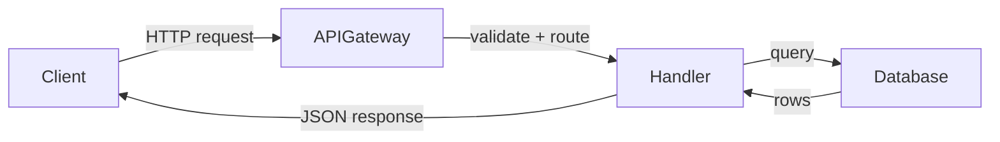

# Page writing

Templates and quality rules for concept pages. For TOC shape and file layout, see [toc-and-layout.md](toc-and-layout.md).

## Write each concept page

For each **concept** page (not `index.md` / `log.md`):

### Read the relevant code

Open and read the actual source files for the section you are writing. Do not guess or hallucinate file contents. If a file is too large, read the parts that matter for the current section.

### Write frontmatter and prose

Write YAML frontmatter first (`type` required; `title` and `description` recommended). Then explain what the code does in plain language. Start with the high-level purpose, then drill into specifics. Every claim should be traceable to a specific file or function.

Each domain page should include these sections (skip any that don't apply to the subsystem):

0. **Active contributors** — a one-line byline immediately after the heading (see [toc-and-layout.md](toc-and-layout.md#per-page-active-contributors))
1. **Purpose** — what this subsystem does, in 2-3 sentences
2. **Directory layout** — a file tree showing the key files and folders
3. **Key abstractions** — a table of the most important types (classes, interfaces, traits, structs, functions) with their file path and a one-line description
4. **How it works** — the main data/control flow, with a Mermaid diagram if it involves 3+ components
5. **Integration points** — how this subsystem connects to others (what it imports, what calls it, what events it emits/listens to)
6. **Entry points for modification** — 2-3 sentences telling a developer where to start if they need to change or extend this subsystem

Let the complexity of the subsystem determine how long the page is. A thin wrapper might only need sections 1, 3, and 5. A complex subsystem might need all six with multiple diagrams.

### Add Mermaid diagrams

Use Mermaid diagrams to illustrate:

- **Architecture** — system components and how they connect
- **Data flows** — request lifecycle, event pipelines, processing stages
- **State machines** — authentication flows, order states, build pipelines

Mermaid diagram guidelines:

- Use `graph TD` or `graph LR` for architecture and flow diagrams
- Use `sequenceDiagram` for request/response flows between services
- Use `stateDiagram-v2` for state machines
- Keep diagrams focused — 5 to 15 nodes maximum. Split larger diagrams into multiple smaller ones
- Label edges with the action or data being passed
- Use subgraphs to group related components

Example:

````markdown

````

Do not use Mermaid for simple relationships that a sentence can explain. A diagram should earn its place by showing something that is hard to describe in words.

### Add file references

Each domain page must include a **"Key source files"** table listing the most important files for that subsystem:

```markdown
| File                        | Purpose                                        |
| --------------------------- | ---------------------------------------------- |
| `src/auth/middleware.ts`    | Validates JWT tokens, attaches user to request |
| `src/auth/token-service.ts` | Token creation, refresh, and revocation        |
```

The table should cover whatever files are important — don't pad it with trivial files and don't skip files just because there are few.

Reference every file you mention in prose. When mentioning a class, interface, function, or type, include its file path in backticks on first mention. Always use the **full path from the repository root** (e.g., `apps/backend/src/auth/middleware.ts`, not just `middleware.ts`). These paths are rendered as clickable source code links, and short filenames without directory paths will produce broken links. Readers should be able to go from the documentation to the code in one step.

### Cross-link pages

Link between concept pages with markdown links. Prefer bundle-root absolute paths (stable when files move within a subdirectory):

```markdown
For details on how the auth middleware integrates with the API layer,
see [API authentication](/api/authentication.md).
```

Relative links (`./`, `../`) are fine inside the same directory. Each concept page should link to at least one other page. Broken links are tolerable for not-yet-written pages, but prefer fixing them in the assembly pass.

### Fun facts content

The `fun-facts.md` page is optional but encouraged. Pick the 3-5 most interesting topics for the specific repo from this list:

- **Oldest surviving code** — find the oldest file or function via git blame. How old is it? Has it changed much?
- **Dependency archaeology** — the oldest dependency still in use, or the one with the most major version bumps
- **Naming origins** — why is the project or its internal tools named what they are? Engineers name things weirdly and there's usually a story
- **TODO/FIXME count** — how many TODO/FIXME/HACK comments exist? What's the oldest one?
- **The longest file** — which source file has the most lines? A gentle call-out that doubles as a refactoring hint

Do not force all of these into every wiki. Pick only the ones where the repo has something genuinely interesting to say. If nothing stands out, skip fun-facts entirely.

## Content principles

### Progressive disclosure

Directory `index.md` listings let readers see what exists before opening concept pages. On each concept page, put a 1–3 sentence summary near the top (and mirror it in frontmatter `description`). Follow with the main concepts; put implementation details, edge cases, and configuration options later.

A reader skimming root/section listings plus the first paragraph of each concept page should get a useful overview of the entire system.

### Page size limit

Keep individual pages under 500KB. If a page approaches this limit, split it into sub-pages. For example, a large API reference page could become a directory with one page per endpoint group.

### Human writing rules

Write documentation that reads like a person wrote it. Technical docs are especially prone to AI-sounding patterns because the subject matter is dry. Fight that tendency.

**Specific rules to follow:**

1. **Cut inflated significance.** Do not write "serves as a testament to," "pivotal role in the evolving landscape," "setting the stage for," or "underscores the importance of." Just state what the thing does.

   Bad: "The authentication module serves as a critical pillar in the application's security landscape."
   Good: "The authentication module validates JWT tokens and attaches user context to requests."

2. **Cut promotional language.** Do not write "boasts," "vibrant," "rich," "profound," "showcasing," "exemplifies," "commitment to," "groundbreaking," "renowned," or "breathtaking." Technical docs describe; they do not sell.

   Bad: "The codebase boasts a rich set of vibrant utilities that showcase the team's commitment to developer experience."
   Good: "The `utils/` directory has helpers for string formatting, date parsing, and retry logic."

3. **Kill superficial -ing analyses.** Do not tack "highlighting," "ensuring," "reflecting," "symbolizing," "showcasing," or "contributing to" onto sentences to add fake depth.

   Bad: "The service processes events asynchronously, ensuring scalability while highlighting the system's robust architecture."
   Good: "The service processes events asynchronously. It pulls from an SQS queue and can handle ~500 events/second per instance."

4. **Avoid AI vocabulary words.** These words appear far more often in AI-generated text: additionally, crucial, delve, emphasizing, enduring, enhance, fostering, garner, interplay, intricate/intricacies, landscape (abstract), pivotal, showcase, tapestry (abstract), testament, underscore (verb), vibrant. Replace them with plainer alternatives.

5. **Skip the rule of three.** Do not force ideas into groups of three to sound comprehensive (e.g., "innovation, inspiration, and industry insights"). If there are two things, list two. If there are four, list four.

6. **Do not use copula avoidance.** Write "X is Y" or "X has Y" instead of "X serves as Y," "X stands as Y," "X represents Y," "X boasts Y," "X features Y," or "X offers Y."

   Bad: "The config module serves as the central hub for environment variable management."
   Good: "The config module reads environment variables and exports typed constants."

7. **Do not use negative parallelisms.** Avoid "It's not just X, it's Y" and "Not only X but Y" constructions.

8. **Use sentence case in headings.** Write "Getting started with authentication," not "Getting Started With Authentication."

9. **Cut filler phrases.** Replace "in order to" with "to," "due to the fact that" with "because," "it is important to note that" with nothing (just state the fact).

10. **Be specific, not vague.** Replace "industry experts believe" with a concrete reference. Replace "several components" with the actual component names. Replace "various configurations" with the actual config options.

11. **Avoid em dash overuse.** Use commas or periods instead of em dashes (—) in most cases. One em dash per page is fine; three or more is a pattern.

12. **Do not use chatbot artifacts.** Never write "I hope this helps," "Let me know if," "Here is an overview of," "Certainly!", or "Great question!" These are conversation patterns, not documentation.

### Concrete file references

Every factual claim about the code should point to the source file. Do not say "the system handles authentication" without saying where. Do not say "the database schema includes a users table" without pointing to the migration or model file.

When mentioning source files in inline code (backticks), always use the **full path from the repository root**. These backtick-wrapped file paths are automatically rendered as clickable links to the source code on GitHub/GitLab. Using just the filename will produce a broken link.

- Good: `apps/backend/src/app/api/v0/wiki/route.ts`
- Good: `.github/workflows/release-cut.yml`
- Bad: `route.ts` (ambiguous, link will 404)
- Bad: `release-cut.yml` (missing directory path, link will 404)

If you cannot find the file that implements something, say so: "The retry logic is referenced in `config.ts` but the implementation was not found in the current codebase."

### Mermaid diagram usage

Include at least one Mermaid diagram in the architecture page. Include diagrams in domain pages when they help explain data flows or component relationships. Do not add diagrams to every page — a page about configuration options or environment variables probably does not need one.
